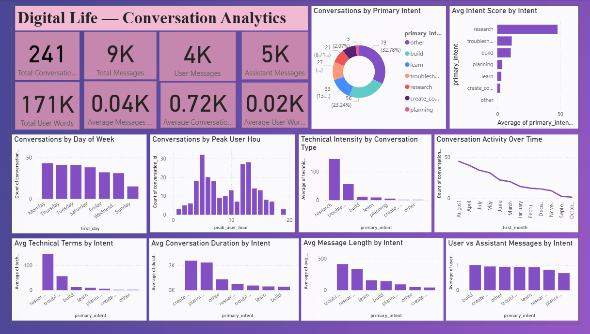
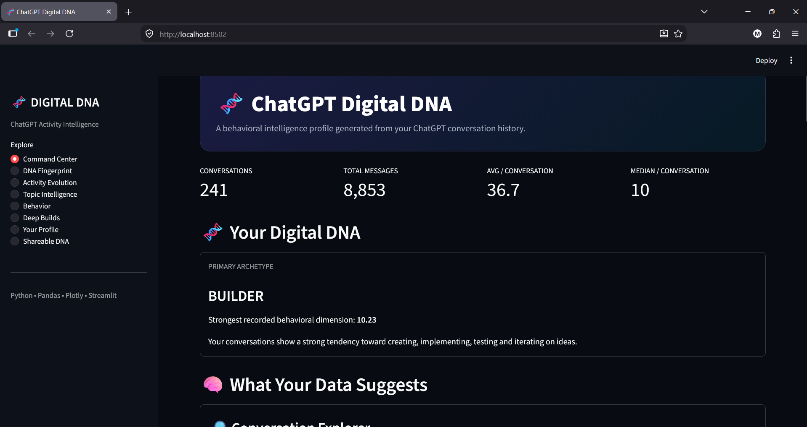

# 🧬 Digital DNA

> An interactive personal analytics project that transforms conversation data into insights about communication patterns, interests, activity, technical behavior, and digital personality.

---

## 🚀 Project Overview

**Digital DNA** is a personal data analytics project built from ChatGPT conversation history.

The project transforms raw conversation data into structured analytical features and presents the results through:

- 📊 **Power BI** — professional BI dashboard for analytical exploration
- 🖥️ **Streamlit** — interactive Python-based web application
- 🧬 **Digital DNA Radar** — visual representation of conversation patterns and behavioral traits

The goal is to explore how conversations evolve over time, what topics dominate, when activity is highest, and what patterns can be discovered from personal conversation data.

---

# 🎯 Project Objectives

The project aims to answer questions such as:

- How many conversations and messages were exchanged?
- How active are conversations over time?
- When is conversation activity highest?
- What are the most common conversation intents?
- Which intents have higher technical intensity?
- How does user activity compare with assistant activity?
- How long do conversations typically last?
- How does message length vary across conversation intents?
- What patterns emerge from conversation behavior?
- What does the conversation history reveal about digital interests and behavioral traits?

---

# 🛠️ Tech Stack

| Technology | Purpose |
|---|---|
| Python | Data processing and analysis |
| Pandas | Data manipulation and feature analysis |
| Plotly | Interactive visualizations |
| Streamlit | Interactive web application |
| Power BI | Business intelligence dashboard |
| CSV | Processed analytical datasets |
| Git & GitHub | Version control and project showcase |

---

# 📊 Power BI Dashboard

The **Power BI dashboard** provides a professional business-intelligence view of the conversation dataset.

It focuses on KPIs, trends, intent analysis, technical intensity, and conversation behavior.

### Dashboard Includes

- Total Conversations
- Total Messages
- User Messages
- Assistant Messages
- Total User Words
- Average Conversation Metrics
- Average User Message Metrics
- Conversations by Primary Intent
- Average Intent Score
- Conversations by Day of Week
- Conversations by Peak User Hour
- Technical Intensity by Conversation Type
- Conversation Activity Over Time
- Average Technical Terms by Intent
- Average Conversation Duration by Intent
- Average Message Length by Intent
- User vs Assistant Message Ratio

### 📊 Power BI Dashboard Preview



---

# 🖥️ Streamlit Application

The Streamlit application provides an interactive web-based experience for exploring the conversation analytics.

The application uses Python, Pandas, Plotly, and Streamlit to transform the processed datasets into an interactive analytical interface.

### Streamlit Features

- 📈 Interactive conversation analytics
- 📊 KPI metrics
- 🎯 Conversation intent analysis
- ⏱️ Activity and time-based analysis
- 🧠 Technical behavior analysis
- 💬 Conversation behavior analysis
- 🧬 Digital DNA analysis
- 📸 Shareable Digital DNA view

### 🖥️ Main Streamlit Dashboard



---

# 🧬 Digital DNA Radar

One of the unique components of the project is the **Digital DNA Radar**.

Instead of only showing traditional analytics, the project transforms conversation patterns into a visual representation of recurring traits, interests, and behavioral signals.

The Digital DNA section provides a more personal and creative interpretation of the analytical results.

### 🧬 Digital DNA Radar


The Digital DNA component can be used as a visual summary of the conversation history and as a shareable project artifact.

---

# 📈 Key Metrics

The processed conversation dataset contains conversation-level analytical features including:

- Conversation ID
- Total Messages
- User Messages
- Assistant Messages
- User/Assistant Message Ratio
- Conversation Duration
- Active Days
- Messages per Hour
- Average User Message Length
- Median User Message Length
- Maximum User Message Length
- Average User Words
- Total User Words
- First Hour
- First Day
- First Month
- First Year
- Peak User Hour
- Technical Term Count
- Primary Intent
- Primary Intent Score

---

# 🔍 Analytical Areas

## 1. Conversation Activity

Analyze conversation activity across:

- Days of the week
- Months
- Years
- Peak user hours

This helps identify when conversation activity is concentrated and how usage changes over time.

---

## 2. Conversation Intent

Conversation intents are analyzed to understand the dominant types of interactions.

The dashboard compares:

- Intent frequency
- Intent scores
- Message behavior by intent
- Conversation duration by intent
- Message length by intent

---

## 3. Technical Intensity

The project analyzes technical terminology across conversations to identify which conversation intents are more technically focused.

This provides an additional analytical layer beyond simple conversation counts.

---

## 4. Conversation Behavior

The project analyzes:

- Message volume
- User messages
- Assistant messages
- User/assistant ratios
- Message length
- Conversation duration
- Active days
- Messages per hour

---

# 🧠 Data Processing

The raw conversation history was transformed into structured analytical datasets.

The processing pipeline includes:

```text
Raw Conversation Data
        ↓
Data Extraction
        ↓
Data Cleaning
        ↓
Conversation-Level Aggregation
        ↓
Feature Engineering
        ↓
Intent & Behavioral Analysis
        ↓
Power BI + Streamlit
```

The resulting analytical features make it possible to perform conversation-level analysis instead of relying only on raw message records.

---

# 📁 Project Structure

```text
Digital-DNA/
│
├── data/
│   └── conversation_features.csv
│
├── powerbi/
│   └── Digital-Life-Analytics.pbix
│
├── screenshots/
│   ├── powerbi-dashboard.png
│   ├── streamlit-dashboard.png
│   ├── digital-dna-radar.png
│   └── project-overview.png
│
├── streamlit/
│   └── app.py
│
├── README.md
├── requirements.txt
└── .gitignore
```

---

# ⚙️ Running the Streamlit Application

## 1. Clone the Repository

```bash
git clone <YOUR_GITHUB_REPOSITORY_URL>
```

## 2. Navigate to the Project

```bash
cd Digital-DNA
```

## 3. Install Dependencies

```bash
pip install -r requirements.txt
```

## 4. Run the Streamlit Application

```bash
streamlit run streamlit/app.py
```

The application will then open in your browser.

---

# 📊 Opening the Power BI Dashboard

The Power BI dashboard is included in:

```text
powerbi/
```

Open the `.pbix` file using **Microsoft Power BI Desktop**.

The Power BI dashboard provides the dedicated BI and analytics experience of the project.

---

# 📸 Project Showcase

The repository includes visual previews of the major project components:

- `screenshots/powerbi-dashboard.png` — Power BI analytics dashboard
- `screenshots/streamlit-dashboard.png` — Main Streamlit dashboard
- `screenshots/digital-dna-radar.png` — Digital DNA Radar
- `screenshots/project-overview.png` — Overall project view

---

# 💡 Project Highlights

This project demonstrates the ability to:

- Work with personal real-world data
- Transform raw data into structured analytical datasets
- Perform data cleaning and feature engineering
- Create conversation-level metrics
- Analyze behavioral patterns
- Build meaningful KPIs
- Perform intent-based analysis
- Analyze technical intensity
- Design professional Power BI dashboards
- Build interactive Streamlit applications
- Create visual data storytelling experiences
- Combine analytical and creative data visualization

---

# 🌟 Why This Project Is Different

Instead of analyzing a generic public dataset, this project explores **personal conversation data**.

It combines traditional data analytics with a more creative concept:

> **What can your conversation history reveal about the way you interact with technology?**

The project therefore sits at the intersection of:

**Data Analytics + Personal Analytics + AI + Data Visualization**

---

# 🔮 Future Improvements

Potential future extensions include:

- 🤖 Automated conversation classification
- 😊 Sentiment analysis
- 🧠 Topic modeling
- 🔎 Conversation similarity analysis
- 📊 Advanced behavioral segmentation
- 📈 Time-series forecasting
- 🤖 AI-generated analytical insights
- 🧬 More advanced Digital DNA scoring
- 📅 Personal analytics timeline
- 🔥 Conversation streak analysis

---

# 👨‍💻 Author

**Munendhira S N**

B.Tech — Artificial Intelligence & Data Science

---

## ⭐ Project

If you find this project interesting, consider giving the repository a ⭐ star.
